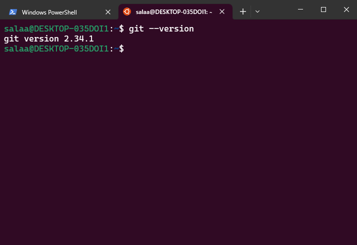
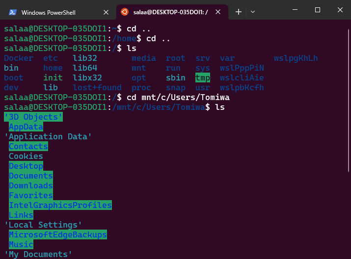
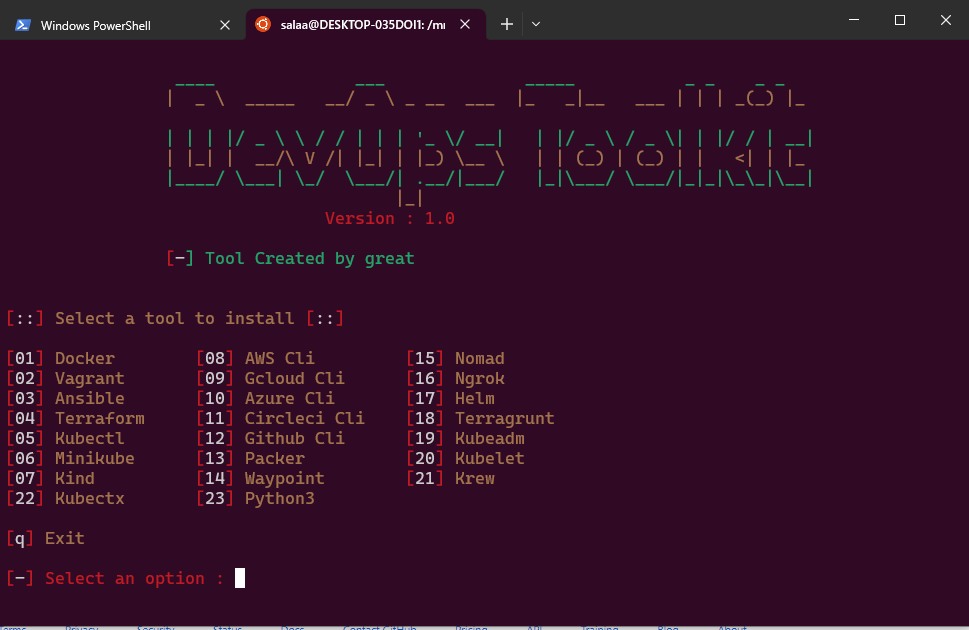

# Windows-DevOps-Toolkit

[](https://github.com/tterb/atomic-design-ui/blob/master/LICENSEs)


Windows-DevOps-Toolkit helps you easily and quickly set-up your Cloud and Devops development environment on Windows Subsystem for Linux(WSL). WSL lets developers install a Linux distribution(such as Ubuntu, OpenSUSE, Kali, Debian, etc) and development tools directly on Windows, without the overhead of a traditional virtual machine or dual boot setup.

# Enable Virtualization

Enable virtualization on your local machine BIOS. This [guide](https://support.microsoft.com/en-us/windows/enable-virtualization-on-windows-11-pcs-c5578302-6e43-4b4b-a449-8ced115f58e1) helps you with it. 

# Install Linux on Windows with WSL

Start Windows Command Prompt or Windows Powershell in administrator mode by right-clicking and selecting "Run as administrator", reference [here](https://learn.microsoft.com/en-us/windows/wsl/install), run the following commands:

```
  wsl --install 
```
The "wsl --install" defaultly install the Ubuntu distribution of Linux. 

```
  wsl -l -v 
```
Check the version installed--should be WSL2, if you are on WSL1, upgrade to WSL2--reference [here](https://dev.to/adityakanekar/upgrading-from-wsl1-to-wsl2-1fl9).

# Install Windows Terminal 

Reference [here](https://learn.microsoft.com/en-us/windows/terminal/install), install Windows Terminal and restart your machine. 

# Run Toolkit on WSL

Start a Windows Terminal, open a Ubuntu tab.

Check if git is installed:

```
  git --version
```


Otherwise, install git:
```
 sudo apt update -y && sudo apt upgrade -y 
```
```
  sudo apt install git 
```

To view your Windows files/directories, go to your root directory(/), then your Windows Users directory mounted on WSL:

```
  cd ..
  cd ..
  ls
  cd mnt/c/Users/
  ls
```


# Run Package

Clone the project

```
  git clone https://github.com/TomiwaAribisala-git/windows-devops-toolkit.git
```

Go to the project directory

```
  cd windows-devops-toolkit
```

Run Script

```
  bash setup.sh
```
 
# Toolkit Interface



# Credits 

Big thanks to [Great](https://github.com/umegbewe) his [Devops-toolkit](https://github.com/umegbewe/devops-toolkit) projected this idea. 